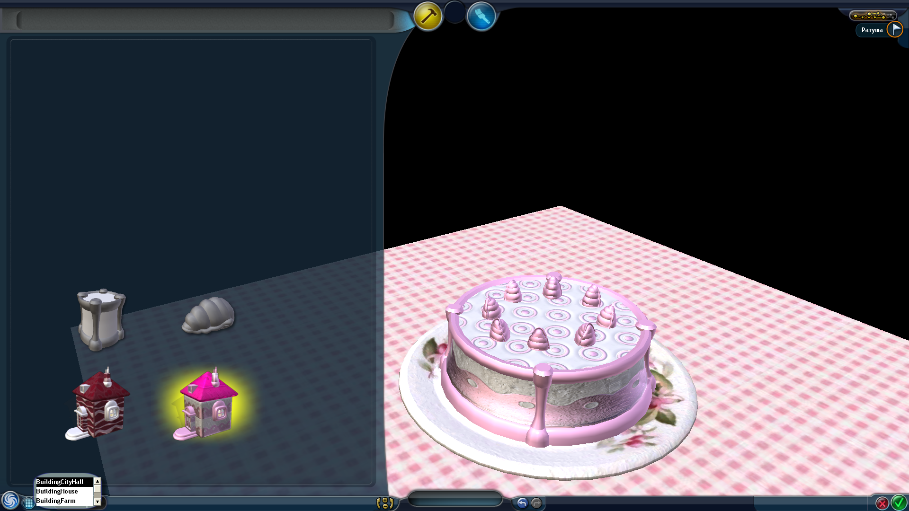

# Spore — Cake Editor Mod
This mod fixes an unused Cake Editor hidden in the Spore files. You can launch it with `-state:cake` or `-state:CakeEditor` args or with ChocIce75's [Enter Editor mod](https://github.com/VanillaCold/SporeEnterEditor/releases/latest) by pressing **Ctrl + Shift + C** and typing `enterEditor cake`.

** This mod is incompatible with [Davo Grox Editor](https://davoonline.com/phpBB3/viewtopic.php?t=52) or other mods that add/modify Spore's states.**

